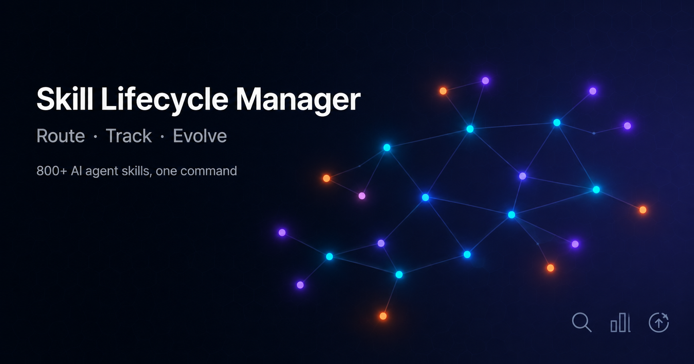

# Skill Lifecycle Manager



[](LICENSE)
[](https://python.org)
[](https://docs.anthropic.com/en/docs/claude-code)
[](#architecture)
[](#6-tier-model-routing-v11)
[](https://github.com/Evgeniy-Mikhailove/skill-lifecycle/stargazers)

**Stop losing skills in a sea of INDEX.md entries.** Find the right one in seconds, track what works, and let skills learn from your experience.

> **Works with:** Claude Code, Codex CLI, Gemini CLI, and any AI agent that uses markdown-based skills.
> **Zero dependencies** beyond Python 3.9+. No frameworks, no cloud services, just files and scripts.

---

### Before

You have 200 skills in INDEX.md. A task comes in. You scroll... guess... pick one... hope it works. Three months later, you install the same skill twice because you forgot it existed.

### After

```
$ python skill_router.py "set up CI/CD pipeline with Docker"

DIRECT (apply now):
  1. cicd-quick-setup [devops-cicd] (score: 60.0)
  2. ci-cd-automation [devops-cicd] (score: 48.0)

POTENTIAL (next steps):
  1. test-driven-development [code-quality] (score: 12.0)
  2. security-and-hardening [review-debug-security] (score: 5.0)
```

5 matches + 5 next steps. 0.2 seconds. Every skill categorized, tracked, and growing smarter with use.

---

## The Problem

You install 20 skills. Then 50. Then someone publishes a pack of 754 cybersecurity skills and you grab those too. Now you have 800+ skills and three problems:

1. **You can't find them.** Half your skills are registered in INDEX.md but never categorized. When a task comes in, you rely on memory instead of search — and memory doesn't scale.

2. **You don't know what works.** Some skills are battle-tested, others were installed once and forgotten. No usage data, no feedback loop.

3. **Skills rot.** A skill written 6 months ago references an API that changed, a library that got deprecated, or an approach that you've since found a better alternative for. Nothing captures that knowledge.

## The Solution

Seven small Python scripts that give your skills a lifecycle:

```
Install → Route → Apply → Log → Evolve → Recommend → Audit
```

No frameworks, no dependencies beyond Python 3.9+, no magic. Just files and scripts.

## Quick Start

```bash
# Clone
git clone https://github.com/Evgeniy-Mikhailove/skill-lifecycle.git
cd skill-lifecycle

# Run the installer — it copies scripts to your Claude Code orchestration directory
python install.py

# Build your registry from existing skills
python ~/.claude/orchestration/build_registry.py

# Try routing a task
python ~/.claude/orchestration/skill_router.py "set up CI/CD pipeline with Docker"
```

That's it. Your skills are now searchable, categorized, and trackable.

## What Each Tool Does

### `skill_router.py` — Find the right skill for a task

Takes a task description, searches your entire skill library, returns two lists:
- **DIRECT (5):** Skills that match the task right now
- **POTENTIAL (5):** Adjacent skills for your next step

```bash
$ python skill_router.py "build a RAG pipeline with vector database"

DIRECT (apply now):
  1. ai-knowledge-architect [ai-ml-agents] (score: 36.0)
     Designs RAG systems, vector databases, memory layers...
     why: trigger: rag, phrase: rag
  2. prompt-systems-engineering [ai-ml-agents] (score: 34.5)
     Prompt engineering for agents, CoT, ReAct, RAG, ToT...
     why: trigger: rag

POTENTIAL (next steps / scaling):
  1. agents-langchain [ai-ml-agents] (score: 10.0)
     LLM-powered applications with agents, chains, RAG...
  2. senior-backend [coding-dev] (score: 4.5)
     Scalable backend systems, Node.js, Go, Python, Postgres...
```

It also searches skill packages (large collections like cybersecurity skill sets) if you have any installed.

**Post-task recommendations** — after finishing work, ask what's next:

```bash
$ python skill_router.py --post-task vulnerability-scanner,find-bugs "API security audit"

NEXT STEPS (related skills):
  1. test-driven-development [code-quality] — write regression tests
  2. security-and-hardening [review-debug-security] — harden the fixes
  3. dependency-optimizer [coding-dev] — audit vulnerable dependencies
```

### `skill_register.py` — One command, full registration

Install a new skill and it automatically:
- Reads the SKILL.md frontmatter (name, description, tags)
- Picks the best group out of 14 categories
- Generates trigger keywords
- Writes to three files at once: `REGISTRY.json`, `INDEX.md`, `ROUTER_REGISTRY.md`

```bash
$ python skill_register.py ~/.claude/skills/my-new-skill/

Registering: ~/.claude/skills/my-new-skill/SKILL.md

  Skill ID:    my-new-skill
  Description: Automated database migration with zero-downtime rollback
  Group:       devops-cicd
  Triggers:    database, migration, zero-downtime, rollback, schema

  [REGISTRY.json] ADDED new entry: my-new-skill
  [INDEX.md] ADDED: my-new-skill
  [ROUTER_REGISTRY.md] ADDED to 'devops-cicd': my-new-skill

DONE. Skill 'my-new-skill' fully registered in all 3 locations.
```

No more forgetting to categorize. No more invisible skills.

### `skill_usage.py` — Know what works

Log every skill application with an outcome:

```bash
# After using a skill successfully
python skill_usage.py log vulnerability-scanner "API security audit" success

# When a skill needed tweaks to work
python skill_usage.py log telegram-bot-builder "sales bot prototype" adjusted

# When a skill didn't help at all
python skill_usage.py log some-old-skill "tried for auth flow" failed
```

Then analyze:

```bash
$ python skill_usage.py report

Total entries: 47
Unique skills used: 12
Outcomes: success=38 adjusted=7 failed=2
Last 7 days: 15 uses
Last 30 days: 47 uses

Top 5 most used skills:
  1. vulnerability-scanner        12 ############  (s:11 a:1 f:0)
  2. copywriting                   8 ########      (s:8 a:0 f:0)
  3. ci-cd-automation              6 ######        (s:5 a:1 f:0)

Skills that needed adjustment (7 times):
  telegram-bot-builder: 3x — consider evolving this skill

$ python skill_usage.py unused
Never used (126 of 138):
  [coding-dev] (24): browser-extension-builder, clean-architecture-enforcer, ...
  [ai-ml-agents] (13): agents-langchain, agents-llamaindex, ...
```

### `skill_evolve.py` — Skills that learn from experience

This is the one that changes everything. When you hit a problem while using a skill and figure out a workaround — record it *in the skill itself*:

```bash
$ python skill_evolve.py learn ci-cd-automation \
    "GitHub Actions runner fails on Windows with path too long" \
    "Use actions/checkout with short path and set MSYS=winsymlinks:nativestrict"

Lesson added to ci-cd-automation:
  Problem:  GitHub Actions runner fails on Windows with path too long
  Solution: Use actions/checkout with short path and set MSYS=winsymlinks:nativestrict
  File: ~/.claude/skills/ci-cd-automation/SKILL.md
```

This appends directly to the skill's SKILL.md:

```markdown
## Lessons Learned

### [2025-01-15] GitHub Actions runner fails on Windows with path too long
**Problem:** GitHub Actions runner fails on Windows with path too long
**Solution:** Use actions/checkout with short path and set MSYS=winsymlinks:nativestrict
```

Next time anyone uses this skill, they see the known pitfalls and proven solutions.

When an approach becomes outdated:

```bash
$ python skill_evolve.py deprecate ci-cd-automation \
    "Using docker-compose v1 syntax" \
    "Use docker compose v2 (no hyphen) — v1 is EOL since July 2023"
```

Find skills that haven't been updated in a while:

```bash
$ python skill_evolve.py stale 90
Stale skills (not modified in 90+ days): 42
  browser-extension-builder   [coding-dev]     last: 2024-10-03
  flowise-builder             [automation-api]  last: 2024-09-28
  ...
```

### `audit.py` — Health check everything

```bash
$ python audit.py

============================================================
  SKILL AUDIT REPORT
============================================================

  Registered skills:  138
  On disk:            137
  In INDEX.md:        138
  Packages:           1 (754 skills)
  Total ecosystem:    892

WARNINGS:
  [~] ORPHANS — on disk but not in REGISTRY (2): my-experiment, old-draft

GROUP DISTRIBUTION:
  coding-dev                      27 ###########################
  ai-ml-agents                    15 ###############
  automation-api                  15 ###############
  ...

CYBERSECURITY PACKAGE: OK (754/754 skills on disk)

STATUS: ALL CLEAR
```

### `build_registry.py` — Rebuild from scratch

Scans all SKILL.md files on disk, reads their frontmatter, auto-categorizes, and generates a fresh `REGISTRY.json`:

```bash
$ python build_registry.py

REGISTRY.json built: 138 skills
  coding-dev: 27
  ai-ml-agents: 15
  automation-api: 15
  ...
```

### `build_canvas.py` — Visual map for Obsidian

Generates an Obsidian `.canvas` file showing your skill ecosystem as a visual graph:

```bash
$ python build_canvas.py --output ~/vault/skill-map.canvas

Canvas built: ~/vault/skill-map.canvas
  16 nodes, 23 edges
  138 individual + 754 in packages
```

Open it in Obsidian to see all 14 groups with connections between related domains.

## 6-Tier Model Routing (v1.1)

Skills don't just match tasks - they route to the optimal model. The router now supports 6 cost tiers across 3 providers:

| Tier | Model | Provider | Cost | Best For |
|------|-------|----------|------|----------|
| 1 | Haiku 4.5 | Anthropic | $1/$5 per MTok | Classification, tagging, validation, routing |
| 2 | Gemini 2.5 Pro | Google | Low | Summarization, extraction, translation, broad context |
| 3 | GPT-5.3 Codex | OpenAI | Low-Med | Focused coding, refactoring, tests |
| 4 | Sonnet 4.6 | Anthropic | $3/$15 per MTok | Standard engineering, debugging, multilingual content |
| 5 | Fable 5 | Anthropic | $10/$50 per MTok | Narrative, storytelling, creative brainstorm |
| 6 | Opus 4.8 | Anthropic | $5/$25 per MTok | Architecture, security, root cause analysis |

### Escalation Policy

```
haiku (gate-keeping)
  -> gemini / openai (by task type)
    -> sonnet (main workhorse)
      -> fable (if creative)
      -> opus (if risky / deep architecture)
```

Each skill in the registry can specify a preferred model tier. The router uses the skill's group and priority to suggest the right model alongside the skill match.

### Task-to-Model Quick Reference

| Task | Model | Why |
|------|-------|-----|
| "Is this a bug or feature?" | Haiku | Binary classification, instant |
| "Summarize this 50-page doc" | Gemini | Large context, cheap |
| "Write a Python function for X" | GPT Codex | Code-optimized |
| "Debug this n8n workflow" | Sonnet | Context understanding |
| "Write a story for newsletter" | Fable | Built for narrative |
| "Design the auth architecture" | Opus | Deep reasoning needed |

## Architecture

```
~/.claude/
├── orchestration/           ← All lifecycle tools live here
│   ├── REGISTRY.json        ← Single source of truth (all skills, triggers, groups)
│   ├── ROUTER_REGISTRY.md   ← Human-readable routing table
│   ├── skill_router.py      ← Task → skill matching
│   ├── skill_register.py    ← New skill → auto-categorize → register
│   ├── skill_usage.py       ← Log + analyze usage
│   ├── skill_evolve.py      ← Record lessons, deprecate old approaches
│   ├── audit.py             ← Health check
│   ├── build_registry.py    ← Rebuild REGISTRY.json from disk
│   ├── build_canvas.py      ← Generate Obsidian visual map
│   ├── config.py            ← Path configuration
│   ├── usage.log            ← Usage data (auto-created)
│   └── evolution.log        ← Evolution history (auto-created)
│
├── skills/
│   ├── my-skill/
│   │   └── SKILL.md         ← Skill definition + Lessons Learned
│   ├── another-skill/
│   │   └── SKILL.md
│   ├── cybersecurity-skills/ ← Example skill package (754 skills)
│   │   ├── index.json
│   │   └── skills/
│   └── INDEX.md              ← Flat skill list
```

## Skill Groups

The system organizes skills into 14 semantic groups with an adjacency graph for cross-domain recommendations:

| Group | What it covers |
|-------|---------------|
| `coding-dev` | Languages, frameworks, architecture |
| `ai-ml-agents` | RAG, agents, LLM, prompt engineering |
| `automation-api` | API integration, webhooks, workflow automation |
| `orchestration-meta` | Claude Code internals, skill management, context |
| `design-media` | UI/UX, visual design, image generation |
| `code-quality` | TDD, debugging, refactoring, test generation |
| `content-marketing` | Copywriting, social media, sales automation |
| `review-debug-security` | Code review, vulnerability scanning, OWASP |
| `devops-cicd` | Docker, CI/CD, deployment, infrastructure |
| `files-documents` | Excel, Word, PDF, PowerPoint |
| `obsidian-knowledge` | Obsidian markdown, knowledge graphs |
| `research-analytics` | Market research, academic papers, data analysis |
| `planning-management` | Project planning, business analysis |
| `cybersecurity` | Threat hunting, forensics, pentesting (package) |

## Multi-Agent Support

If you run multiple AI agents (e.g., Claude Code + Codex, or a team of specialized agents), the lifecycle protocol supports coordination:

- **Shared registry:** All agents read from the same `REGISTRY.json`
- **Shared skills:** Skills in a common directory are available to all agents
- **Shared evolution:** When any agent adds a lesson to a SKILL.md, all agents benefit
- **Per-agent logging:** Each agent can maintain its own usage log

See `SKILL_LIFECYCLE_PROTOCOL.md` for the full cross-agent coordination spec.

## CLAUDE.md Integration

Add this to your project or global `CLAUDE.md` to activate automatic routing:

```markdown
## Skill Auto-Routing

For every non-trivial task:
1. Run `python ~/.claude/orchestration/skill_router.py "<task description>"`
2. Apply DIRECT results silently (read their SKILL.md, follow the methodology)
3. Keep POTENTIAL results in mind for the next step

## Skill Lifecycle

- Install: `python ~/.claude/orchestration/skill_register.py <path>`
- Log usage: `python ~/.claude/orchestration/skill_usage.py log <id> "<task>" <outcome>`
- Record lesson: `python ~/.claude/orchestration/skill_evolve.py learn <id> "<problem>" "<solution>"`
- Health check: `python ~/.claude/orchestration/audit.py`
```

## Configuration

All paths are auto-detected from your Claude Code installation. To override, create `~/.claude/orchestration/config.json`:

```json
{
  "registry_path": "/custom/path/REGISTRY.json",
  "index_path": "/custom/path/INDEX.md",
  "canvas_output": "/my/obsidian/vault/skill-map.canvas"
}
```

Or set the `SKILL_LIFECYCLE_HOME` environment variable to point to a non-standard `.claude` directory.

## FAQ

**Do I need hundreds of skills for this to be useful?**
No. The router and register are valuable starting from 10-15 skills. The evolution system pays off the moment you hit your first workaround.

**Does this work with skill packages (large collections)?**
Yes. The router searches both individual skills and packages. Packages are registered as a single entry with their own internal index.

**Can I use this without Obsidian?**
Yes. The canvas generator is optional. Everything else works purely with files and the terminal.

**Does this modify my existing SKILL.md files?**
Only `skill_evolve.py` does — and only by appending `## Lessons Learned` or `## Deprecated Approaches` sections at the end. It never modifies existing content.

**What about skill packages from third parties?**
Clone them into your skills directory, then register as a package in `REGISTRY.json`. The router will search their `index.json` automatically.

## Documentation

- [Getting Started](docs/getting-started.md) — installation, first run, daily workflow
- [Architecture](docs/architecture.md) — how routing, scoring, and evolution work internally
- [Lifecycle Protocol](SKILL_LIFECYCLE_PROTOCOL.md) — the full 7-stage methodology
- [Contributing](CONTRIBUTING.md) — how to help improve the project
- [Changelog](CHANGELOG.md) — version history

## License

Apache 2.0 — use it however you want.
